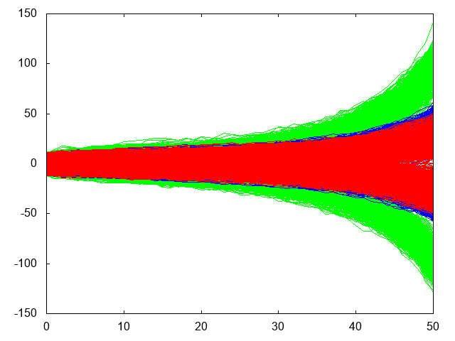
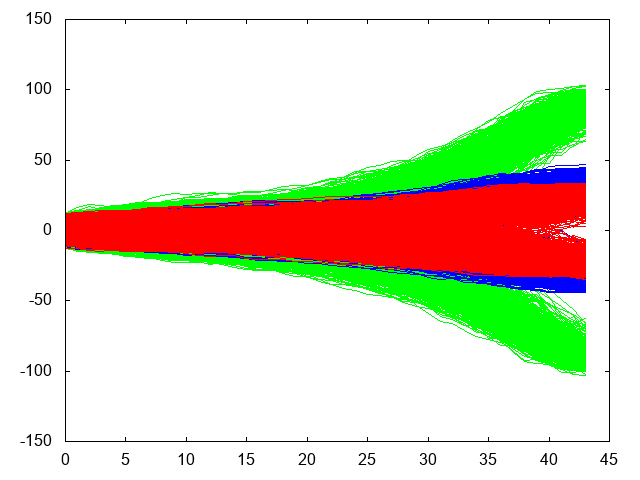
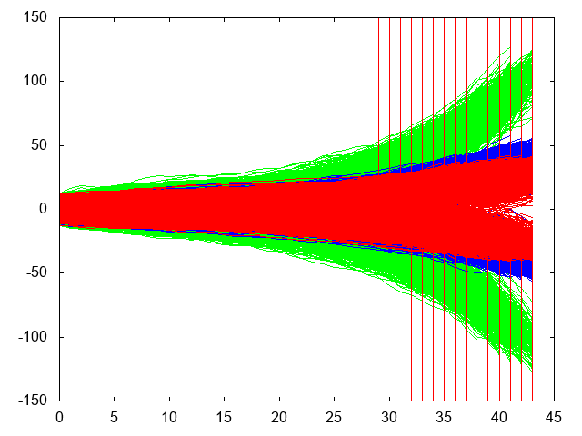

Playing with [Low-density parity-check codes](https://en.wikipedia.org/wiki/Low-density_parity-check_code)

To study LDPC codes I've implemented a soft decision decoder using floating point operations only.

You can switch between three [Belief propagation](https://en.wikipedia.org/wiki/Belief_propagation) algorithms:

* min-sum-c algorithm: using minimum, addition and a correction factor
* sum-product algorithm: using tanh+atanh-functions, addition and multiplication
* log-sum-product algorithm: using log+exp-functions to replace above multiplication with addition in the log domain

Decoding speed varies about 20ms (no errors) to 500ms (max errors) for the rate 1/2 N=64800 code using min-sum-c on my workstation.

Here some good reads:
* Low-Density Parity-Check Codes  
by Robert G. Gallager - 1963
* Near Shannon Limit Performance of Low Density Parity Check Codes  
by David J.C. MacKay and Radford M. Neal - 1996
* An introduction to LDPC codes  
by William E. Ryan - 2003
* DVB-S2 Low Density Parity Check Codes with near Shannon Limit Performance  
by Mustafa Eroz, Feng-Wen Sun and Lin-Nan Lee - 2004
* [en_302307v010201p.pdf](http://www.etsi.org/deliver/etsi_en/302300_302399/302307/01.02.01_60/en_302307v010201p.pdf)
* [a83-1_dvb-s2_den302307v141.pdf](https://www.dvb.org/resources/public/standards/a83-1_dvb-s2_den302307v141.pdf)

### Impact of the varying degrees of the bit nodes on their convergence behaviour

The color on the following three plots are to be interpreted like this:
* Red: parity bit nodes with degree two
* Green: message bit nodes with degree eight
* Blue: message bit nodes with degree three

This is the fastest algorithm, min-sum-c, but it needs a few iterations longer to converge:


The sum-product algorithms converge much faster than the min-sum algorithms, but they involve [transcendental functions](https://en.wikipedia.org/wiki/Transcendental_function).


Here we see the fastest convergence, where bit nodes go to minus or plus infinity (and sometimes back from):


### [dvb_s2_tables.hh](dvb_s2_tables.hh)

DVB-S2 LDPC parity bit address tables

Entries are copied from: [a83-1_dvb-s2_den302307v141.pdf](https://www.dvb.org/resources/public/standards/a83-1_dvb-s2_den302307v141.pdf)

### [exclusive_reduce.hh](exclusive_reduce.hh)

Reduce N times while excluding ith input element

It computes the following, but having only O(N) complexity and using O(1) extra storage:

```
	output[0] = input[1];
	output[1] = input[0];
	for (int i = 2; i < N; ++i)
		output[i] = op(input[0], input[1]);
	for (int i = 0; i < N; ++i)
		for (int j = 2; j < N; ++j)
			if (i != j)
				output[i] = op(output[i], input[j]);
```


